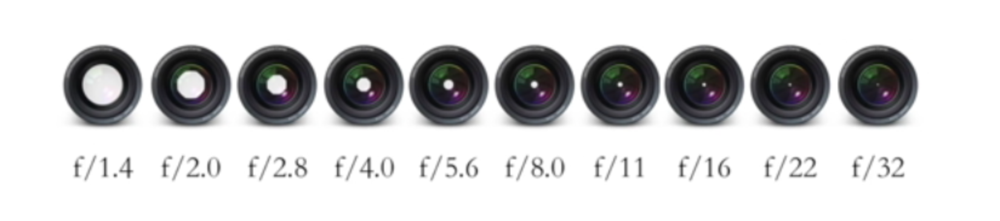
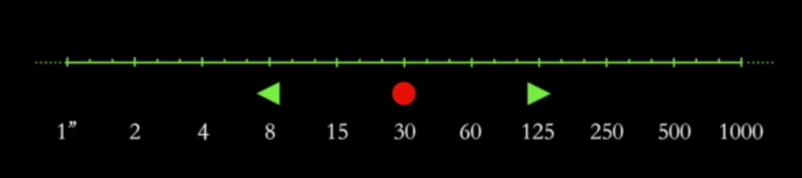
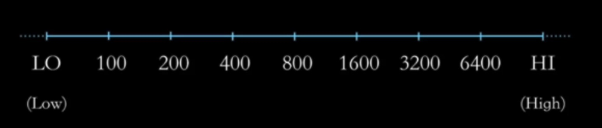
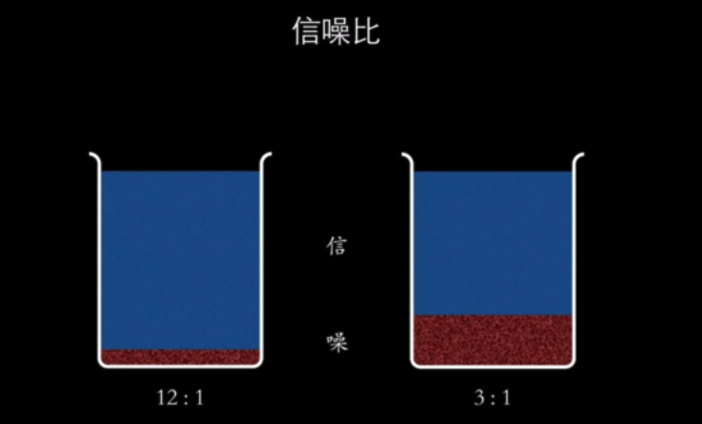

# 曝光三要素

## 光圈

## 快门

### 高速快门的效果

* 定格运动中的物体
  *  蜂鸟的翅膀大约每秒抖动 60 次，用 1/1000 的快门速度基本可以
  *  运动员 1/250 的快门
* 抵消相机的抖动
* 动静结合的画面
*  追拍
*  慢速快门记录汽车行驶轨迹， 烟花的轨迹，捕捉闪电， 人群运动轨迹，水滴效果，水流的轨迹，记录海浪轨迹

### 安全的快门速度

1. 长焦镜头 ， 需要更高的快门速度
2. 安全快门 < 1/等效焦距

## 感光度

### 常见的国际标准感光度值

### 信噪比

