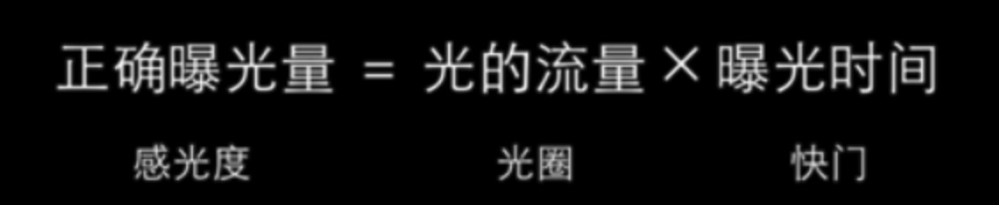
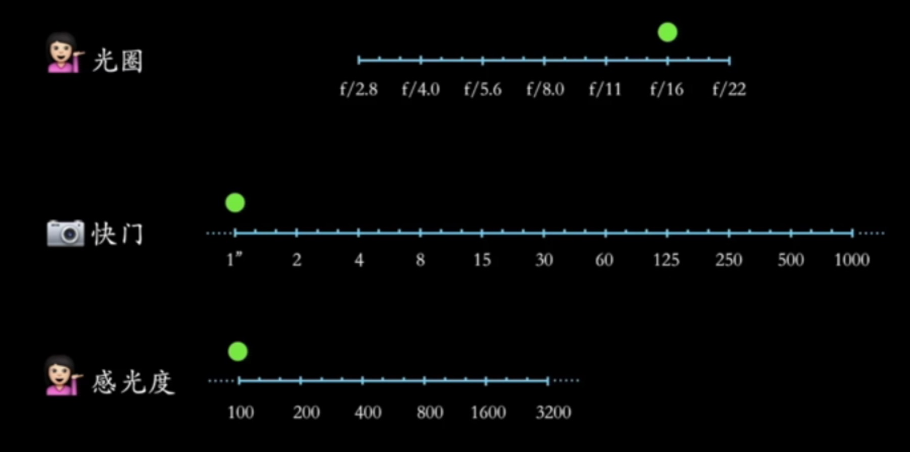

# 控制曝光

[创建日期]: # '2018-02-25 11:47:26'

## 测光

## 测光模式

1. 平均测光
1. 中央重点平均测光
1. 局部测光
1. 点测光
   

## 互易律

## 自动及半自动曝光模式

1. 人像模式：使用大光圈，色彩偏暖，美化肤色
1. 风光模式：使用小光圈，色彩鲜艳，凸显蓝绿
1.  儿童模式：使用  高速快门，跟踪对焦
1.  运动模式：使用  高速快门，跟踪对焦
1.  微距模式：使用大光圈，色彩鲜艳，使用最大放大倍率
1. 夜景模式：大光圈，慢快门，允许大面积暗色出现， 若使用  闪光灯，则为慢速同步闪光模式

## 光圈优先模式

## 快门优先曝光及自动感光度

## 手动曝光模式
